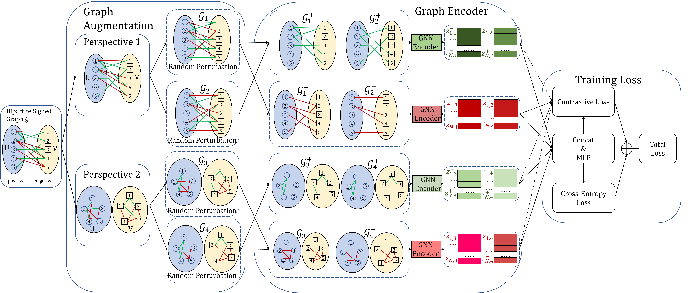

# Contrastive Learning for Signed Bipartite Graphs

## Introduction

Contrastive learning has achieved great success in improving the robustness of graph representation learning. Although recent studies have introduced contrastive learning for signed graphs, no existing study has been conducted specifically on signed bipartite graphs, which widely exist in social networks, recommender systems, paper review platforms, etc. This paper is the first to exploit contrastive learning for signed bipartite graphs. Different from signed graphs, a signed bipartite graph has two types of nodes, and the edges (either positive or negative) only connect two nodes of different types. Existing signed graph contrastive learning methods only work on
links that exist in the graph. As a result, these methods are incapable of capturing the implicit relations between two nodes of the same type in signed bipartite graphs. To this end, we propose a Signed Bipartite Graph Contrastive Learning (SBGCL) method to learn robust node representation while retaining the implicit relations
between nodes of the same type. SGGCL augments a signed bipartite graph with a novel two-level graph augmentation method. At the top level, we maintain two perspectives of the signed bipartite graph, one presents the original interactions between nodes of different types, and the other presents the implicit relations between nodes of the same type. At the bottom level, we employ stochastic perturbation strategies to create two perturbed graphs in each perspective. Then, we construct positive and negative samples from the perturbed graphs and design a multi-perspective contrastive loss to unify the node presentations learned from the two perspectives. Experimental results on real-world datasets demonstrate the effectiveness of the proposed model over state-of-the-art methods



## Datasets

We have four datasets, i.e., review, Bonanza, ML-1M, AmazonBook. we randomly select 10% of the links as test set, 5% for validation set, and the remaining 85% as training set for each of our datasets. You can download it in ```datasets``` foalder.

## Dependency
In order to run this code, you need to install following dependencies:

```
pip install torch numpy sklearn torch_geometric
```

## Run Example

The number of train epochs for review is 300, as it is a small datsets. But for other three datsets, the number of training epochs is 2000.

```bash
python train.py --dataset=review-1 --epochs=300
```


